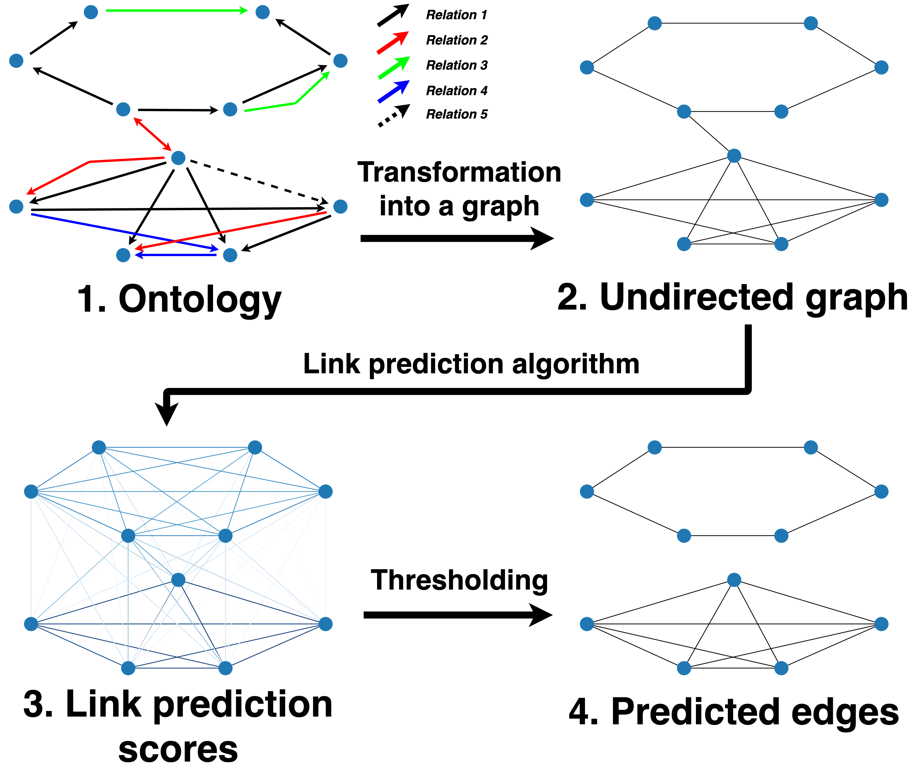
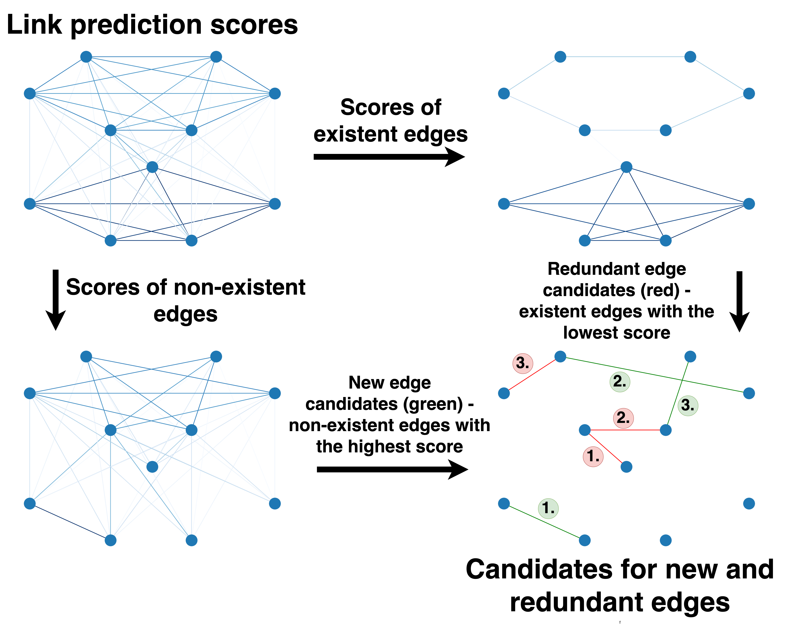
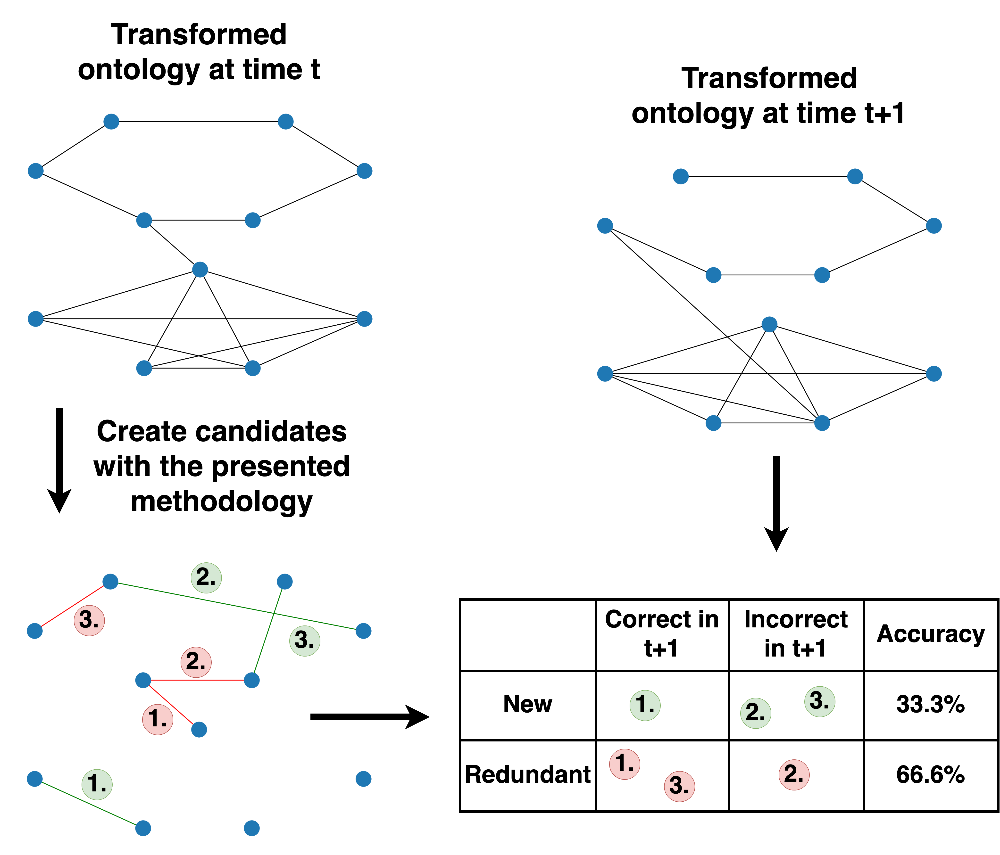
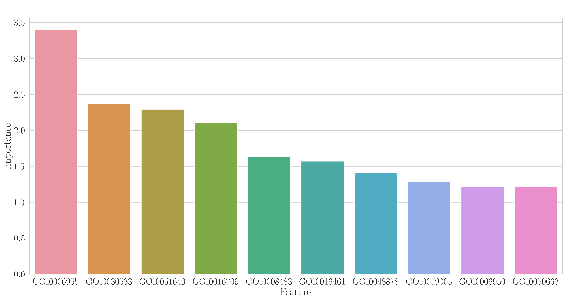
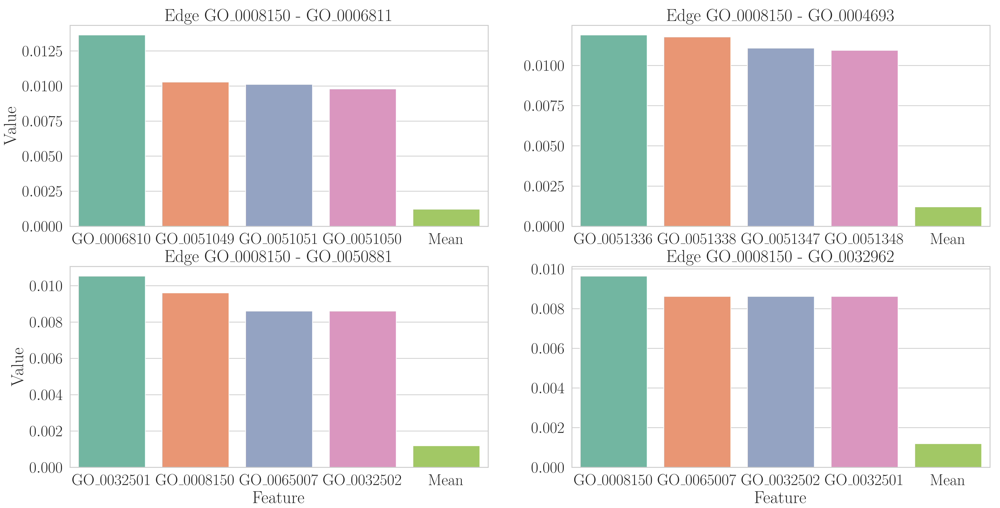

# Link Analysis meets Ontologies: Are Embeddings the Answer?
This repository contains code that is used and presented as part of the paper **_Link Analysis meets Ontologies: Are 
Embeddings the Answer?_**, that can be found [here](https://arxiv.org/abs/2111.11710).

## Getting started

To use the code, first download it to your computer. This can be done by running the following command.
```
git clone git@github.com:smeznar/anomaly-detection-in-ontologies.git
```
After this you need to setup the environment. To run the code we suggest using a Docker image provided in this repository.
You can build the image by using the command 
```
sudo docker build -t link-analysis .
```
from the `root` folder. Note that the docker version uses CPU-only PyTorch.

The environment can also be set up manually. We suggest using python 3.6, as some dependencies need this version to work
optimally. Using _pip_, dependencies can be satisfied by running the following commands from the root folder:

```
pip install -r requirements.txt
pip install torch==1.10.0+cpu -f https://download.pytorch.org/whl/cpu/torch_stable.html
pip install torch-scatter torch-sparse torch-cluster torch-spline-conv torch-geometric -f https://data.pyg.org/whl/torch-1.10.0+cpu.html
```

Your environment should now be ready, follow the instructions in the sections below for more information regarding the transformation of
ontologies into a graph (and format used throughout all other parts of the repository), run link prediction, create recommendations for
missing and redundant edges, and create _explanations_ of the predicted recommendations.

## Ontology to graph transformation

To use the code in other sections, we first need to transform the ontology into a graph. Our code can read two
different formats (JSON and txt). The JSON format is structured as:
```
{"graphs": {
    "nodes":[{
    	"id": "string" ,
        "type": "string",
        "lbl": "string"}],
    "edges":[{
        "sub": "string",
        "pred": "string",
        "obj": "string"}]}}
```
where nodes is a list of nodes with id "id", type "type", and label "lbl", and edges are triplets where "sub" is the 
subject, "pred" predicate (relation), and "obj" object.

The txt file is formated as:
```
subject\t object\t predicate 
```

Some examples of transformed ontologies (the ones used in the paper) can be found inside the data directory together with their
[origin and sources](data/README.md). If you want to test our approach on your own ontology, you can transform an `.owl`
file into a JSON file by using the script ``src/conversion.py`` as 
```
python src/conversion.py --filename {filename} --out {out}
```
or
```
sudo docker run -v $(pwd):/app --rm link-analysis src/conversion.py --filename {filename} --out {out}
```
if you are using Docker. Argument _{filename}_ is a placeholder for the path to the .owl file, while _{out}_ represents
the output path where .json file will be stored.

A knowledge graph can also be used with this approach, if transformed into a suitable format.

## Link prediction

An overview of the link prediction methodology is presented in the image below.



Using this benchmark you should get the following results:

TBA: slika z rezultati

link prediction benchmark (5-fold cross-validation) can be run by using the command from the src directory:
```
python link_prediction.py --method {method} --dataset {data set} --format {format} --out {out}
```
where _{method}_ is the baseline used, _{dataset}_ is the directory of the dataset, _{format}_ is the format type of the 
dataset, and _{out}_ is the directory where the results will be stored. We suggest path ``results/{filname}.txt`` for
the _{out}_ argument, especially when the Docker image is used.

If you are using the Docker image, the command should have the following form:
```
sudo docker run -v $(pwd):/app --rm link-analysis src/link_prediction.py --method {method} --dataset {data set} --format {format} --out {out}
```
Note that ``-v $(pwd):/app`` in this command makes the folder of the repository (with all the code and data) visible
to the Docker image. Examples of command for Docker can be found inside the ``src/benchmark.sh`` file.

By default, the following settings can be used:
- **_{method}_**: _Adamic_, _Jaccard_, _Preferential_, _SNoRe_, _node2vec_, _Spectral_, _TransE_, 
_RotatE_, _GAT_, _GIN_, _GCN_, _GAE_, _metapath2vec_
- **_{data set}_**: ../data/{d}.json, where {d} is one of _anatomy_, _emotions_, _marine_, _scto_, _ehdaa_, _foodon_, _go_,
or ../data/LKN.txt
- **_{format}_**: _json_ or _txt_, depending on the **_{dataset}_** file

You can also add your own method by adding it into the _src/models.py_ file. An example of this can be found in the 
_examples/new_method.py_ file. after doing this you must import the created class inside the _src/link_prediction.py_ 
file as
```
from models import MyMethod
```
and add it to the methods dictionary in the line 15 of the _src/link_prediction.py_ file (in the same way as 
the other methods are).

## Recommendations for missing and redundant edges

The overview of our approach for creating recommendations of missing and redundant edges is shown in the figure below.


An example of recommendation generation is shown in the ``examples/recommendation_generation.py`` script. The example
generates top 20 recommendations for missing and redundant edges connected to node http://purl.obolibrary.org/obo/GO_0008150
in the Gene ontology. The recommendations are generated with `SNoRe`.

TBA script for generating recommendations automatically

## Temporal approach for evaluating recommendations

The overview of our approach for evaluating recommendation by using multiple versions of an ontology can be seen in the image below

TBA

## Explanation of recommendations
TBA

### Global explanation
An example of a global explanation can be seen in the image below


A script for creating such explanation can be found in ``src/global_explanation.py``

### Local explanation
An example of a local explanation can be seen in the image below


A script for creating such explanation can be found in ``src/local_explanation.py``

## Credits

Code for transforming ontologies to json files was derived from [KRR-Oxford's OWL2Vec-Star repository](https://github.com/KRR-Oxford/OWL2Vec-Star) 
(version 0.2.0, last accessed: 11/2021).

## Contributing

To contribute, simply open an issue or a pull request!

## Authors

Paper and the corresponding code were created by Sebastian Mežnar, Matej Bevec, Nada Lavrač, and Blaž Škrlj. 

## License

See LICENSE.md for more details.

## Citation

Please cite as:

```
@misc{meznar2021link,
      title={Link Analysis meets Ontologies: Are Embeddings the Answer?}, 
      author={Sebastian Mežnar and Matej Bevec and Nada Lavrač and Blaž Škrlj},
      year={2021},
      eprint={2111.11710},
      archivePrefix={arXiv},
      primaryClass={cs.LG}
}
```
